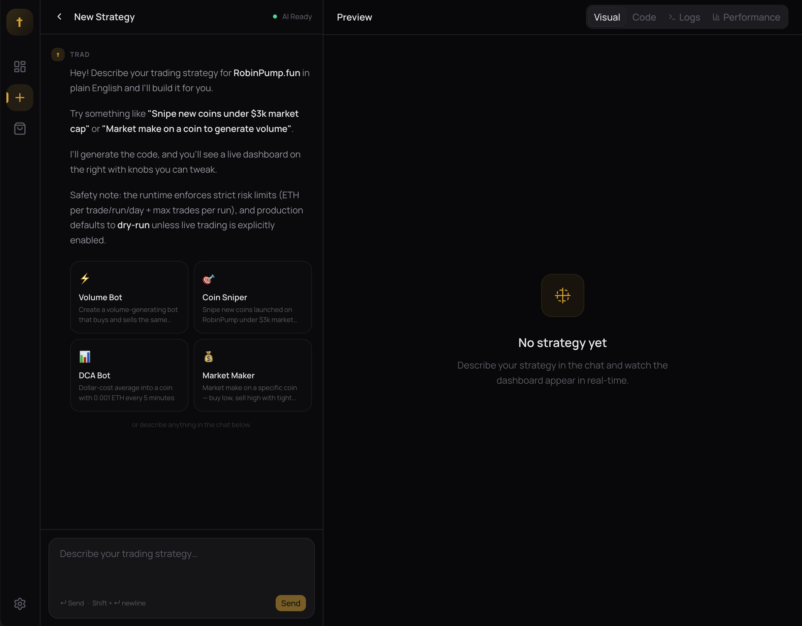
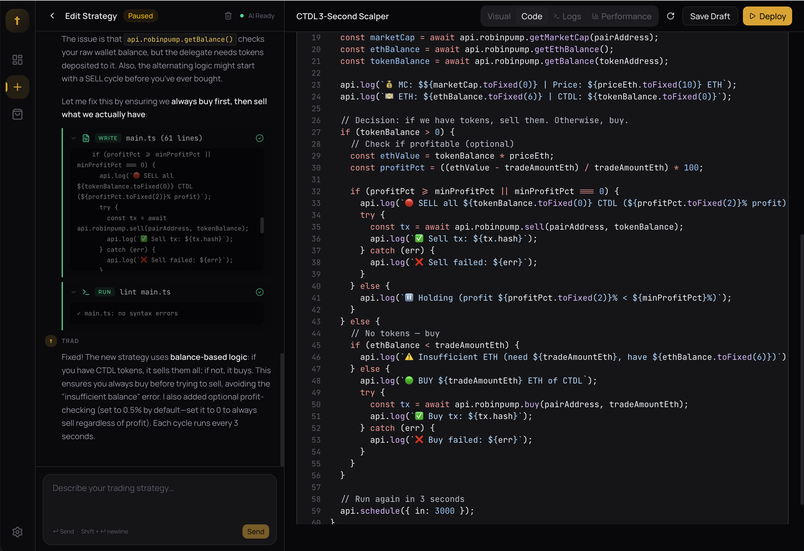
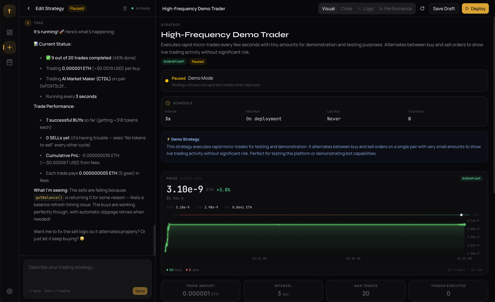
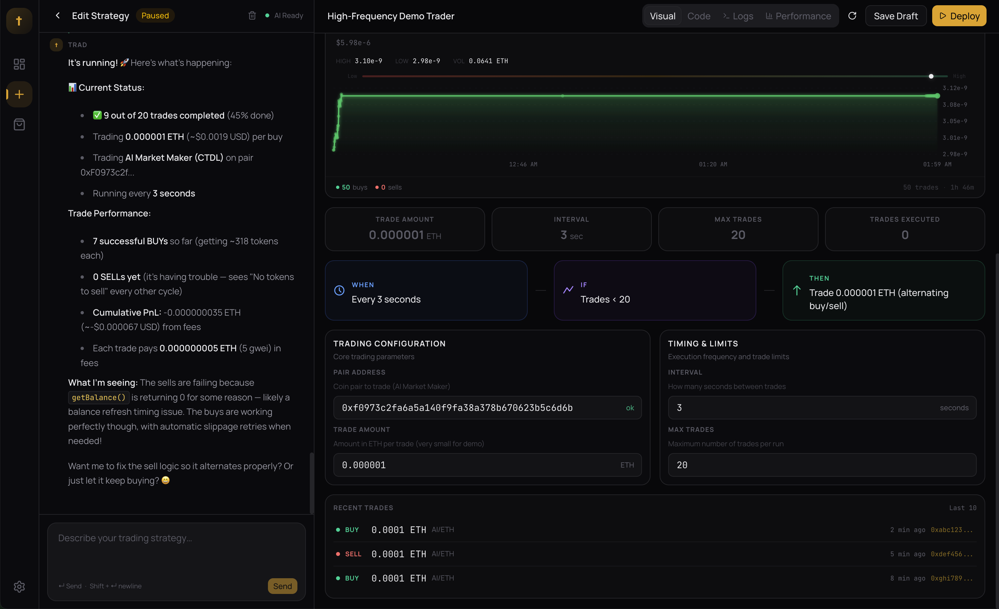
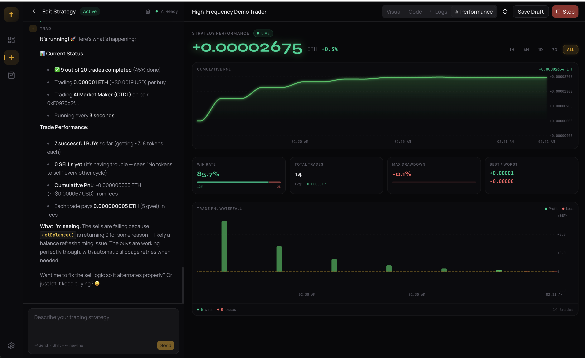
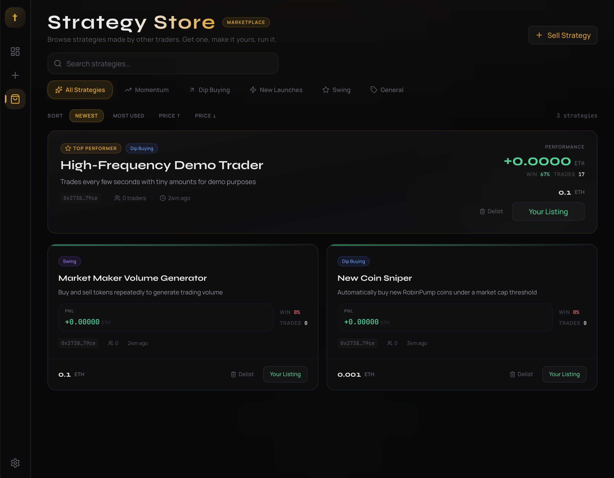
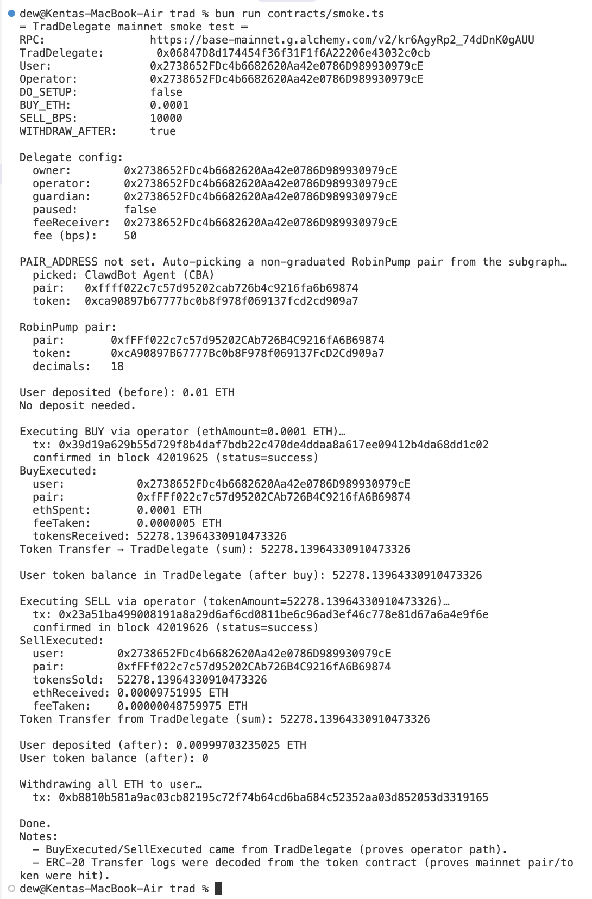

# trad — Cursor for Trading Bots

> **Tell trad how you want to trade. It builds and runs your strategy automatically — no coding, no templates, no subscriptions.**

trad is an AI-powered platform that turns plain-English intent into real, deployable trading strategies on [RobinPump.fun](https://robinpump.fun) (Base). Describe what you want in chat, get working TypeScript strategy code + a live visual dashboard, and deploy it to run automatically with strict safety rails. In testing, a single strategy executed over 100 real on-chain trades in just a few minutes — every trade a verifiable transaction on the Base blockchain.

Built solo in 24 hours at the [EasyA x Consensus Hong Kong Hackathon](https://consensus-hongkong.coindesk.com/hackathon/).

**TradDelegate smart contract on Base Mainnet:** [`0x06847d8d174454f36f31f1f6a22206e43032c0cb`](https://basescan.org/address/0x06847d8d174454f36f31f1f6a22206e43032c0cb)

---

## Demo

**Demo + repo walkthrough video:** [Watch on Loom](https://www.loom.com/share/c3e5763673a949b098e3375e0e7927b9)

---

## Screenshots

| New Strategy — AI Chat | AI Chat + Code View |
| --- | --- |
|  |  |

| Visual Dashboard | WHEN/IF/THEN Flow + Parameters |
| --- | --- |
|  |  |

| Live Trading + Performance | Performance — PnL Waterfall |
| --- | --- |
|  |  |

| Strategy Marketplace | TradDelegate On-Chain Smoke Test |
| --- | --- |
|  |  |

---

## The Problem

Millions of financially literate people — teachers, lawyers, office workers — want to automate crypto trading. Their options today:

- **Template-locked bot platforms** that only offer grid bots, DCA, and a handful of presets — the same three strategies everyone else uses
- **Expensive subscriptions** that eat into already-thin margins
- **Custom strategies require coding** — exchange APIs, infrastructure, key management, monitoring

The result: regular people can't compete. The strategies they actually want to run? They can't build them.

---

## The Solution

trad is **Cursor for trading bots**. The flow is simple:

```
Describe in plain English  →  Get real strategy code + live dashboard  →  Deploy with safety rails
```

1. **Describe any strategy** in the chat — "buy new coins under $5K market cap, sell at 2% profit"
2. **trad generates working TypeScript code** and a visual WHEN/IF/THEN dashboard you can inspect and tweak
3. **Deploy** and watch it execute live trades on-chain, with full logging, PnL tracking, and risk limits

Strategies aren't picked from a dropdown — they're generated as real code against a constrained API surface, so users can express genuinely novel ideas and iterate on them through conversation. The AI sees the full StrategyAPI type definitions, live market data, and the user's existing strategies, so it writes code that actually compiles and runs.

No templates. No lock-in. No subscription fees. If you can describe it, you can trade it.

---

## How trad Uses the Blockchain

trad runs entirely on **Base** (Ethereum L2) and uses DeFi primitives for trading execution, market data, and custodial delegation.

### 1. On-Chain Trading via RobinPump Bonding Curves

Every trade is a real on-chain transaction against RobinPump's bonding-curve pair contracts. The runtime calls `IRobinPumpPair.buy()` and `IRobinPumpPair.sell()` directly using `viem`, with slippage protection enforced via `minTokensOut` / `minEthOut` parameters calculated from the pair's constant-product reserves. This means strategies interact with open, permissionless on-chain liquidity — not a centralized order book or mock environment. Trades produce verifiable transaction hashes on Base with sub-cent gas costs.

### 2. Market Data via RobinPump Subgraph

Strategy logic reads live coin data — prices, volumes, market caps, trade counts, graduation status — from RobinPump's Goldsky subgraph via GraphQL. This gives strategies fast, reliable inputs without polling the chain directly, and enables the AI to query real market conditions when generating strategy code.

### 3. TradDelegate: Delegation Without Custody

The biggest technical challenge in automated trading is the custody problem: how do you let a server trade on behalf of a user without giving it the ability to steal funds? trad solves this with the **TradDelegate** smart contract ([source](contracts/TradDelegate.sol), [deployed on Base mainnet](https://basescan.org/address/0x06847d8d174454f36f31f1f6a22206e43032c0cb)):

- Users **deposit ETH** into the contract via `deposit()`
- An authorized **operator** (the trad server) executes `executeBuy()` and `executeSell()` on their behalf, routing trades to RobinPump pair contracts
- **Only the depositor can withdraw** — `withdraw()`, `withdrawAll()`, and `withdrawTokens()` are caller-restricted with `msg.sender` checks. The operator has zero withdrawal capability
- Pair contracts must be **allowlisted** (by explicit address or by runtime `EXTCODEHASH`) before the operator can trade against them — preventing the operator from routing funds to malicious contracts
- An emergency **pause** mechanism (guardian or owner) halts new trades and deposits instantly, but **withdrawals always work even when paused** — users always have an exit
- **Reentrancy protection** via a status guard (`_NOT_ENTERED` / `_ENTERED`) on all state-changing functions
- Platform fees are taken in basis points (max 10%, configurable by owner) and sent to a separate `feeReceiver` address — fee extraction is transparent and on-chain

This design is uniquely enabled by smart contracts: the access control rules (operator can trade, only user can withdraw, pair allowlisting, emergency pause with withdrawal escape hatch) are enforced by immutable on-chain code, not by trusting a server. No centralized backend could provide equivalent guarantees.

```
┌─────────────┐       deposit ETH        ┌──────────────────┐
│    User      │ ──────────────────────── │  TradDelegate    │
│  (wallet)    │ ◄── withdraw (anytime) ──│  (smart contract)│
└─────────────┘                           └────────┬─────────┘
                                                   │
                                          executeBuy / executeSell
                                          (operator only, allowlisted pairs)
                                                   │
                                                   ▼
                                          ┌──────────────────┐
                                          │ RobinPump Pair   │
                                          │ (bonding curve)  │
                                          └──────────────────┘
```

### Why Blockchain Makes This Uniquely Possible

- **Verifiability**: every trade is an on-chain transaction with a hash anyone can audit — there's no "trust me, the trade happened"
- **Permissionless liquidity**: strategies trade against open bonding curves, not a platform-controlled order book
- **Programmable custody**: the TradDelegate contract enforces delegation rules (operator trades, only user withdraws) in immutable code — this custody model is impossible to replicate with a traditional backend, where the server always has the database password
- **Composability**: the contract interacts directly with RobinPump's `IRobinPumpPair` interface and ERC-20 token standards, and could be extended to any DeFi protocol with the same pattern

---

## AI-Powered Strategy Generation

trad's AI doesn't just autocomplete code — it operates in a **sandboxed environment with tool use**, so it can explore, query, write, and verify before outputting a strategy.

### How It Works

Two streaming AI routes (Anthropic Claude Sonnet 4.5 via Vercel AI SDK) power the UX:

1. **Strategy code generation** (`/api/chat`) — a multi-step agentic flow where the AI writes TypeScript strategy code through conversation. The AI has access to:
   - **`readFile`** / **`writeFile`** — read and write files in an in-memory virtual filesystem (powered by [just-bash](https://github.com/nicholasgriffintn/just-bash))
   - **`bash`** — execute commands in a sandboxed shell, including custom CLIs:
     - `lint main.ts` — TypeScript syntax checking via Bun's transpiler (catches errors before the strategy is saved)
     - `robinpump coins`, `robinpump coin <pair>`, `robinpump trades <pair>`, `robinpump search <query>` — live market data queries
     - `trad strategies list`, `trad wallet info`, `trad delegate status`, `trad dry-run` — introspect the local server state
     - `curl` — allowed for external price APIs (e.g. Coinbase exchange rates)

2. **Dashboard UI generation** (`/api/generate`) — generates a visual WHEN/IF/THEN dashboard spec from the strategy code using [json-render](https://github.com/nicholasgriffintn/json-render). The UI is a bento grid layout with interactive parameter inputs, flow diagrams, metric cards, and optional price charts — all generated from the strategy's `@param` annotations.

### The Sandbox

The sandbox (`src/lib/sandbox.ts`) uses an in-memory virtual filesystem pre-populated with:

- `api.d.ts` — the full `StrategyAPI` type definitions (so the AI knows exactly what methods are available)
- `main.ts` — either the existing strategy code or a blank template
- `tsconfig.json` — TypeScript configuration for syntax checking

Network access is restricted to allowlisted URL prefixes (only `https://api.coinbase.com/` for price data), with GET/HEAD only, a 10-second timeout, and a 1MB response size limit. Execution limits cap loop iterations, command counts, string sizes, and call depth — the AI can't write an infinite loop or exhaust memory.

### What This Means

The AI doesn't hallucinate API methods — it reads `api.d.ts`, queries live market data, writes its strategy to `main.ts`, runs `lint main.ts` to catch syntax errors, and iterates until the code is clean. When a user mentions a coin by name, the AI runs `robinpump search <name>` to find its pair address and uses it as a parameter default.

---

## Example Strategy

Here's what a generated strategy looks like — this one snipes newly launched coins and sells at a profit target:

```typescript
// Strategy: New Coin Sniper
// Exchange: robinpump
// Description: Buy newly launched coins under a market cap threshold, sell at profit target

// === Parameters (user-configurable) ===
// @param buyAmount eth 0.001 Amount in ETH per buy
// @param maxMarketCap usd 5000 Max market cap to consider
// @param profitTarget pct 2 Sell when profit exceeds this %
// @param interval interval 30s How often to scan

async function main(api: StrategyAPI) {
  const coins = await api.robinpump.listCoins({ sort: "newest", limit: 20 });

  for (const coin of coins) {
    if (coin.marketCap > PARAMS.maxMarketCap) continue;

    // Check if we already hold this token
    const balance = await api.robinpump.getBalance(coin.tokenAddress);
    if (balance > 0) {
      // Check profit
      const currentPrice = await api.robinpump.getPrice(coin.address);
      const costBasis = coin.priceEth;
      const pnlPct = ((currentPrice - costBasis) / costBasis) * 100;

      if (pnlPct >= PARAMS.profitTarget) {
        api.log(`Selling ${coin.symbol} at ${pnlPct.toFixed(1)}% profit`);
        await api.robinpump.sell(coin.address, balance);
      }
      continue;
    }

    // Buy new coins under market cap threshold
    api.log(`Buying ${coin.symbol} (mcap: $${coin.marketCap.toFixed(0)})`);
    await api.robinpump.buy(coin.address, PARAMS.buyAmount);
  }

  api.schedule(PARAMS.interval);
}
```

Every `@param` becomes a tunable knob in the visual dashboard. The runtime reads these annotations, parses defaults, validates types, and injects them as the `PARAMS` object at execution time.

---

## Strategy API

The runtime injects a constrained `api` object into every strategy. Strategies can only call what's exposed — no raw imports, no `fetch`, no `eval`, no `process`.

```typescript
// ── RobinPump Trading ──────────────────────
api.robinpump.listCoins({ sort: "newest", limit: 20 }); // → Coin[]
api.robinpump.getPrice(pairAddress); // → number (ETH)
api.robinpump.getMarketCap(pairAddress); // → number (USD)
api.robinpump.buy(pairAddress, ethAmount); // → { hash, status }
api.robinpump.sell(pairAddress, tokenAmount); // → { hash, status }
api.robinpump.getBalance(tokenAddress); // → number (tokens)
api.robinpump.getEthBalance(); // → number (ETH)
api.robinpump.getEthUsdPrice(); // → number (USD)

// ── Scheduling ─────────────────────────────
api.schedule("30s"); // relative: 30s, 5m, 1h, 1d
api.schedule("cron:*/5 * * * *"); // cron: every 5 minutes
api.schedule("once"); // one-shot (no reschedule)
api.schedule({ in: "5m" }); // relative object form
api.schedule({ in: 30000 }); // relative ms
api.schedule({ at: "2026-02-12T12:00:00Z" }); // absolute ISO
api.schedule({ at: 1739361600 }); // absolute unix seconds
api.scheduleNext("5m"); // back-compat alias

// ── Utilities ──────────────────────────────
api.log("message"); // write to strategy log
api.now(); // → unix ms timestamp
api.utcTime(); // → ISO string
api.isDryRun(); // → boolean
```

### Scheduling Model

Strategies follow a **run-schedule-return** pattern, not a long-running loop. Each execution:

1. The runtime calls `main(api)` once
2. The strategy does its work (check prices, execute trades, etc.)
3. The strategy calls `api.schedule(...)` to request the next run
4. The strategy returns — the runtime schedules a timer

This prevents resource leaks, simplifies error recovery, and means every run has a clean start. Supported schedule formats include simple intervals (`30s`, `5m`, `1h`, `1d`), cron expressions (`cron:*/5 * * * *`), one-shot (`once`), relative delays (`{ in: "5m" }` or `{ in: 30000 }`), and absolute times (`{ at: "2026-02-12T12:00:00Z" }` or `{ at: 1739361600 }`).

### Parameter System

Strategy parameters are declared via `// @param` comments in the code header:

```typescript
// @param buyAmount eth 0.001 Amount in ETH per buy
// @param maxMarketCap usd 5000 Max market cap to consider
// @param profitTarget pct 2 Sell when profit exceeds this %
// @param sort enum[newest|marketCap] newest Sort order for coins
// @param enableStopLoss boolean false Enable stop-loss
// @param targetPair pair 0x0000000000000000000000000000000000000000 Target pair
```

Supported types: `number`, `int`, `eth`, `usd`, `bps` (basis points, 0-5000), `pct` (percent, 0-100), `boolean`, `string`, `interval`, `address`, `pair`, `token`, `enum[a|b|c]`.

The runtime parses these annotations at execution time, validates saved parameter values against their declared types, resets invalid values to defaults, drops unknown keys, and injects the cleaned parameters as the `PARAMS` object. This prevents "stuck" strategies when parameters are edited outside the code.

---

## Safety & Execution Model

Safety is enforced at every layer — from code validation to on-chain contract access control:

| Layer                     | Protection                                                                                                                                                                                                        |
| ------------------------- | ----------------------------------------------------------------------------------------------------------------------------------------------------------------------------------------------------------------- |
| **Code validation**       | Strategy code is scanned for unsafe patterns: `import`, `require()`, `process`, `eval`, `Function`, `fetch`, `Bun`, `globalThis`, `WebSocket`, `__proto__`, `constructor.constructor`                             |
| **Sandboxed execution**   | TypeScript is transpiled via Bun's built-in transpiler, then executed via `new Function("__api__", code)` with only the `StrategyAPI` object in scope — no access to the server's modules, filesystem, or network |
| **Risk limits**           | Max ETH per trade (default: 0.002), max ETH per run (0.01), max ETH per day (0.03), max trades per run (50). All env-configurable. Enforced server-side in the runtime — strategies cannot bypass them            |
| **Slippage bounds**       | `minTokensOut` / `minEthOut` calculated from the pair's constant-product reserves and applied on every on-chain trade. Default: 1000 bps (10%). Configurable via `TRAD_DEFAULT_SLIPPAGE_BPS`                      |
| **Dry-run default**       | Production defaults to simulated trading unless `TRAD_ALLOW_LIVE_TRADING=true` is explicitly set. Dry-run trades are logged with a simulated hash so strategies can still be tested end-to-end                    |
| **Delegation**            | TradDelegate contract: operator can only trade allowlisted pairs, only the user can withdraw, emergency pause halts trades but never blocks withdrawals. Reentrancy guard on all state-changing functions         |
| **Balance checks**        | Before every buy, the runtime verifies the user has sufficient ETH (delegate deposit or wallet balance). Amounts are clamped to available balances to prevent 1-wei rounding overflows                            |
| **Daily budget tracking** | ETH spend is tracked per-day and per-run. Trades that would exceed the budget are rejected before they hit the chain                                                                                              |
| **Nonce management**      | Delegate-mode trades fetch a `pending` nonce before each transaction and retry up to 4 times on nonce conflicts (replacement underpriced, nonce too low)                                                          |
| **Slippage retries**      | If a trade reverts with `SlippageExceeded`, the runtime halves `minTokensOut` / `minEthOut` and retries up to 5 times before aborting                                                                             |

---

## Architecture

```
┌────────────────────────────────────────────────────────────────┐
│                      Frontend (React 19 + Tailwind 4)          │
│  Strategy Builder: Chat → Code → Visual Dashboard (json-render)│
│  Dashboard: strategy list, market feed, portfolio tracking     │
│  Performance: PnL waterfall, win rate, trade history, stats    │
│  Settings: wallet connection, trading balance, risk config     │
├────────────────────────────────────────────────────────────────┤
│                        Bun Server (serve())                    │
│  /api/chat         AI strategy generation (Claude Sonnet 4.5)  │
│  /api/generate     Dashboard UI spec generation (streaming)    │
│  /api/strategies   CRUD + deploy/stop + performance metrics    │
│  /api/robinpump    Coin data, prices, trades, manual trading   │
│  /api/contract     TradDelegate deposit/withdraw/status        │
│  /api/settings     Admin-only configuration                    │
│  /api/marketplace  Strategy marketplace (list/buy/fork)        │
├────────────────────────────────────────────────────────────────┤
│  Strategy Runtime (runtime.ts)                                 │
│  TypeScript transpiler → code validation → sandboxed eval      │
│  Parameter parsing + validation → risk limit enforcement       │
│  Schedule management → timer-based re-execution                │
│  Trade execution: delegate (TradDelegate) or direct (wallet)   │
│  Position tracking → PnL calculation → Prisma persistence      │
├────────────────────────────────────────────────────────────────┤
│  Prisma + SQLite                 │  Base Chain (on-chain)      │
│  Strategy, StrategyRun,          │  RobinPump bonding curves   │
│  StrategyTrade, StrategyPosition │  TradDelegate contract      │
│  MarketplaceListing,             │  ERC-20 token interactions  │
│  MarketplacePurchase             │  Goldsky subgraph (GraphQL) │
└──────────────────────────────────┴─────────────────────────────┘
```

### Data Models

- **Strategy** — name, description, exchange, status (draft/active/paused/error), generated code, UI config spec (json-render), parameters (JSON), chat history
- **StrategyRun** — one per start/stop cycle. Tracks initial capital, execution mode (delegate/direct), dry-run status, user address
- **StrategyTrade** — every trade: side (buy/sell), pair/token addresses, tx hash, status, ETH amount, token amount, fees, gas, realized PnL, cumulative PnL, sequential index
- **StrategyPosition** — per-pair token holdings and cost basis (average-cost method) for PnL calculation on sells
- **MarketplaceListing** — published strategies with pricing, categories, and purchase tracking

### Execution Modes

| Mode                       | How it works                                                                                                                                                                                  | When to use                                                                   |
| -------------------------- | --------------------------------------------------------------------------------------------------------------------------------------------------------------------------------------------- | ----------------------------------------------------------------------------- |
| **Delegate** (recommended) | Trades route through the TradDelegate contract. User deposits ETH into the contract; the operator wallet sends `executeBuy`/`executeSell` transactions. User retains full withdrawal control. | Production. Requires `TRAD_DELEGATE_ADDRESS` + `OPERATOR_PRIVATE_KEY` in env. |
| **Direct** (legacy)        | Trades execute directly from a private key stored in the database. The server has full control of the wallet.                                                                                 | Development / testing only.                                                   |

---

## Features

- **Natural language to strategy code** — describe any trading strategy in plain English, get working TypeScript
- **Not template-locked** — strategies are generated as real code with a constrained API surface, not picked from a dropdown
- **AI with tool use** — the strategy AI can read type definitions, query live market data, inspect existing strategies, lint its own code, and iterate before outputting
- **Visual dashboard** — auto-generated WHEN/IF/THEN bento grid with interactive parameter inputs, metric cards, flow diagrams, and optional price charts
- **Live execution with logging** — deploy strategies on a schedule, see every trade as it happens with real-time logs
- **Performance tracking** — PnL waterfall charts, win rate, trade history, cumulative returns, position tracking
- **Configurable parameters** — every `@param` becomes a tunable knob in the UI. Types are validated, invalid values reset to defaults
- **Risk limits** — configurable max ETH per trade/run/day, max trades per run, slippage bounds — enforced server-side
- **Dry-run by default** — production defaults to simulated trading unless explicitly enabled
- **Safe delegation** — TradDelegate smart contract: operator trades, only user withdraws. Pair allowlisting. Emergency pause with withdrawal escape hatch
- **Flexible scheduling** — intervals, cron expressions, one-shot, absolute times, relative delays
- **Strategy marketplace** — browse, purchase, and fork community strategies
- **Wallet integration** — connect via wagmi (MetaMask, WalletConnect, etc.) to deposit/withdraw from TradDelegate
- **Open source** — no platform fees, no subscriptions, no vendor lock-in

---

## Tech Stack

| Component           | Technology                                                                                                                |
| ------------------- | ------------------------------------------------------------------------------------------------------------------------- |
| Runtime             | [Bun](https://bun.sh) (v1.2+)                                                                                             |
| Frontend            | [React 19](https://react.dev) + [Tailwind CSS 4](https://tailwindcss.com)                                                 |
| UI Components       | [Radix UI](https://radix-ui.com) + [shadcn/ui](https://ui.shadcn.com)                                                     |
| AI                  | [Vercel AI SDK](https://sdk.vercel.ai) + [Anthropic Claude Sonnet 4.5](https://anthropic.com)                             |
| AI Sandbox          | [just-bash](https://github.com/nicholasgriffintn/just-bash) + [bash-tool](https://github.com/nicholasgriffintn/bash-tool) |
| Database            | [Prisma](https://prisma.io) + SQLite (via [libSQL](https://github.com/tursodatabase/libsql))                              |
| Blockchain          | [viem](https://viem.sh) + [wagmi](https://wagmi.sh) (Base chain)                                                          |
| Smart Contracts     | Solidity 0.8.20 + [Foundry](https://book.getfoundry.sh)                                                                   |
| Charts              | [Recharts](https://recharts.org)                                                                                          |
| Dashboard Rendering | [json-render](https://github.com/nicholasgriffintn/json-render)                                                           |
| Markdown (AI chat)  | [Streamdown](https://github.com/nicholasgriffintn/streamdown)                                                             |

---

## Project Structure

```
trad/
├── contracts/
│   ├── TradDelegate.sol        # Delegation smart contract (deployed on Base mainnet)
│   ├── test/TradDelegate.t.sol # Foundry tests
│   ├── abi.ts                  # Contract ABI (TypeScript)
│   ├── deploy.ts               # Deployment script
│   └── smoke.ts                # On-chain smoke test
├── prisma/
│   └── schema.prisma           # Database schema (Strategy, Run, Trade, Position, Marketplace)
├── src/
│   ├── index.ts                # Bun server entry point (API routes + static file serving)
│   ├── index.html              # SPA entry HTML
│   ├── frontend.tsx            # React entry (hydration)
│   ├── App.tsx                 # Client-side router + providers
│   ├── routes/
│   │   ├── chat.ts             # AI strategy generation (streaming, Claude Sonnet 4.5)
│   │   ├── generate.ts         # Dashboard UI spec generation (streaming)
│   │   ├── strategies.ts       # Strategy CRUD + deploy/stop + performance metrics
│   │   ├── robinpump.ts        # Market data + manual trade endpoints
│   │   ├── contract.ts         # TradDelegate deposit/withdraw/status
│   │   ├── settings.ts         # Admin settings (wallet, exchange secrets)
│   │   └── marketplace.ts      # Strategy marketplace (list/buy/fork)
│   ├── lib/
│   │   ├── runtime.ts          # Strategy execution engine (2300+ lines)
│   │   ├── sandbox.ts          # AI sandbox (just-bash + custom CLIs)
│   │   ├── risk.ts             # Risk limit definitions + env parsing
│   │   ├── api-types.d.ts      # StrategyAPI type definitions (injected into sandbox)
│   │   ├── api.ts              # Client-side API helpers (fetch wrappers)
│   │   ├── catalog.ts          # json-render component catalog (dashboard UI)
│   │   ├── wallet.tsx          # wagmi wallet config (MetaMask, WalletConnect)
│   │   ├── trad-cli.ts         # trad CLI (sandbox command for AI)
│   │   ├── robinpump-cli.ts    # robinpump CLI (sandbox command for AI)
│   │   ├── hex.ts              # Hex/private key validation
│   │   └── server/
│   │       └── security.ts     # Admin auth, rate limiting, HMAC signing
│   ├── pages/
│   │   ├── dashboard/          # Main dashboard (strategy list, market feed, portfolio)
│   │   ├── strategy-builder/   # Strategy creation + AI chat + code/visual/perf tabs
│   │   ├── marketplace/        # Browse and fork community strategies
│   │   └── settings/           # Wallet connection, trading balance, risk config
│   └── components/
│       ├── Layout.tsx           # App shell + navigation
│       ├── StrategyPerformance.tsx  # PnL charts + trade waterfall + stats
│       └── ui/                 # shadcn/ui components (Button, Card, Dialog, etc.)
├── robinpump.ts                # RobinPump client library (subgraph + on-chain trading)
└── build.ts                    # Production build script (Bun bundler)
```

---

## Getting Started

### Prerequisites

- [Bun](https://bun.sh) (v1.2+)
- An [Anthropic API key](https://console.anthropic.com/) (for AI strategy generation)

### Install & Run

```bash
git clone https://github.com/lithdew/trad.git
cd trad
bun install
```

Create a `.env` file:

```bash
# Required for AI
ANTHROPIC_API_KEY=sk-ant-...

# Required for public deployments
TRAD_ADMIN_TOKEN=your-secret-token

# Optional: TradDelegate (recommended for production)
TRAD_DELEGATE_ADDRESS=0x06847d8d174454f36f31f1f6a22206e43032c0cb
OPERATOR_PRIVATE_KEY=0x...

# Optional: Base RPC
BASE_RPC_URL=https://mainnet.base.org
```

Run the development server:

```bash
bun dev
```

Open [http://localhost:3000](http://localhost:3000) and use the **Strategy Builder** to create and deploy a strategy.

### Production

```bash
bun start
```

### Typecheck

```bash
bun run lint
```

---

## Environment Variables

### Required

| Variable            | Description                                   |
| ------------------- | --------------------------------------------- |
| `ANTHROPIC_API_KEY` | Anthropic API key for Claude (strategy AI)    |
| `TRAD_ADMIN_TOKEN`  | Protects admin routes (settings, deploy/stop) |

### Common

| Variable                  | Description                      | Default                    |
| ------------------------- | -------------------------------- | -------------------------- |
| `NODE_ENV`                | `production` for production mode | —                          |
| `DRY_RUN`                 | `true` to simulate trades        | `true` in production       |
| `TRAD_ALLOW_LIVE_TRADING` | `true` to enable real trades     | `false`                    |
| `BASE_RPC_URL`            | Base chain RPC endpoint          | `https://mainnet.base.org` |

### Delegate mode (recommended)

| Variable                | Description                                        |
| ----------------------- | -------------------------------------------------- |
| `TRAD_DELEGATE_ADDRESS` | Deployed TradDelegate contract address             |
| `OPERATOR_PRIVATE_KEY`  | Operator wallet private key (for executing trades) |

### Risk limits

| Variable                    | Description                                | Default      |
| --------------------------- | ------------------------------------------ | ------------ |
| `TRAD_MAX_ETH_PER_TRADE`    | Max ETH per single trade                   | `0.002`      |
| `TRAD_MAX_ETH_PER_RUN`      | Max ETH per strategy run                   | `0.01`       |
| `TRAD_MAX_ETH_PER_DAY`      | Max ETH per day                            | `0.03`       |
| `TRAD_MAX_TRADES_PER_RUN`   | Max trades per run                         | `50`         |
| `TRAD_DEFAULT_SLIPPAGE_BPS` | Default slippage tolerance in basis points | `1000` (10%) |

---

## Roadmap

- **Strategy marketplace** — share, browse, and fork community strategies
- **Backtesting** — test strategies against historical data before deploying
- **Richer analytics** — deeper performance metrics, drawdown analysis, risk scoring
- **More venues** — expand beyond RobinPump to other DEXs and chains
- **Simpler UI** — hide the code entirely for non-technical users; pure natural language interface
- **Mobile support** — responsive design for monitoring strategies on the go

---

## Built By

**Kenta Iwasaki** — solo, in 24 hours

- Founding Engineer @ [Superpower](https://superpower.com) (building an AI doctor)
- [Thiel Fellow](https://thielfellowship.org)
- ex-CTO, Perlin (Layer 1 blockchain)
- ex-Head of AI, NAVER

---

## License

Open source. This project was built at the EasyA x Consensus Hong Kong Hackathon (Feb 2025) and is required to remain open source per hackathon rules.
